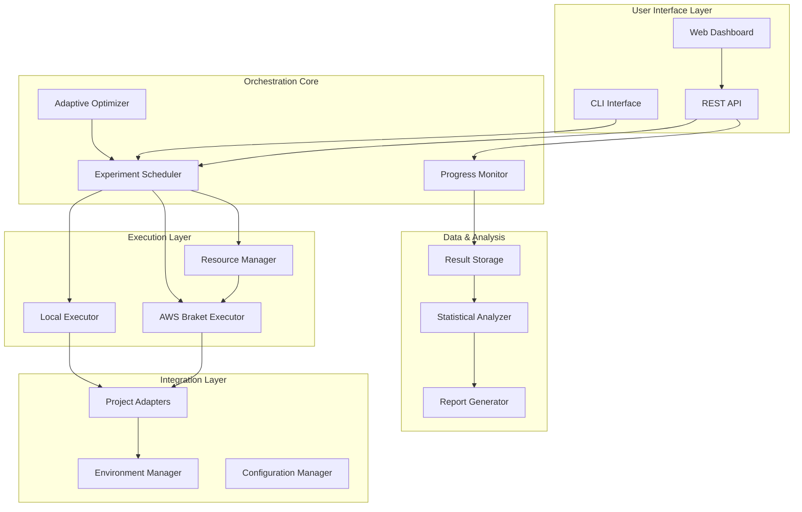

# Design Document

## Overview

The Intelligent Experiment Orchestration System is designed as a modular, event-driven platform that transforms isolated quantum experiments into a coordinated research workflow. The system follows a microservices-inspired architecture with clear separation of concerns, enabling researchers to scale from single experiments to large-scale parameter sweeps while maintaining scientific rigor and cost efficiency.

The design leverages existing project structures and utilities, extending them with orchestration capabilities rather than replacing them. This ensures seamless integration with current workflows while providing powerful new research capabilities.

## Architecture

### High-Level System Architecture



### Core Components

#### 1. Experiment Scheduler
**Purpose**: Central orchestration engine that manages experiment queues, parameter generation, and execution coordination.

**Key Responsibilities**:
- Generate parameter combinations from sweep configurations
- Prioritize experiments based on adaptive optimization feedback
- Distribute experiments across available compute resources
- Handle experiment failures and retries
- Maintain execution state and progress tracking

**Interfaces**:
- `schedule_sweep(config: SweepConfig) -> SweepExecution`
- `get_execution_status(execution_id: str) -> ExecutionStatus`
- `pause_execution(execution_id: str) -> bool`
- `resume_execution(execution_id: str) -> bool`

#### 2. Adaptive Optimizer
**Purpose**: Analyzes intermediate results to guide experiment prioritization and resource allocation.

**Key Responsibilities**:
- Analyze experiment results in real-time
- Identify promising parameter regions using Bayesian optimization
- Recommend early stopping for poor-performing experiments
- Adjust sampling density based on performance gradients
- Maintain statistical validity through minimum coverage requirements

**Interfaces**:
- `analyze_results(results: List[ExperimentResult]) -> OptimizationRecommendation`
- `update_priorities(execution_id: str, recommendations: OptimizationRecommendation) -> bool`
- `should_early_stop(experiment: Experiment, partial_results: PartialResult) -> bool`

#### 3. Resource Manager
**Purpose**: Optimizes compute resource allocation and manages AWS Braket costs and limits.

**Key Responsibilities**:
- Monitor AWS service limits and quotas
- Optimize device selection for cost-effectiveness
- Implement intelligent throttling and load balancing
- Track costs and provide budget alerts
- Suggest simulator alternatives when appropriate

**Interfaces**:
- `get_optimal_device(circuit: Circuit, budget: float) -> DeviceRecommendation`
- `check_service_limits() -> ServiceLimitStatus`
- `estimate_cost(experiments: List[Experiment]) -> CostEstimate`
- `throttle_requests(rate_limit: float) -> bool`

#### 4. Project Adapters
**Purpose**: Seamlessly integrate existing projects without requiring code changes.

**Key Responsibilities**:
- Wrap existing project classes with orchestration interfaces
- Handle parameter injection and result extraction
- Manage project-specific environments and dependencies
- Preserve existing logging and testing patterns
- Enable cross-project metric normalization

**Interfaces**:
- `adapt_project(project_path: str) -> ProjectAdapter`
- `execute_with_parameters(params: Dict[str, Any]) -> ExperimentResult`
- `extract_metrics(result: Any) -> StandardizedMetrics`
- `validate_compatibility() -> CompatibilityReport`

## Components and Interfaces

### Data Models

#### SweepConfiguration
```python
@dataclass
class SweepConfiguration:
    project_paths: List[str]
    parameters: Dict[str, ParameterRange]
    objectives: List[str]
    constraints: Dict[str, Any]
    budget_limit: Optional[float]
    max_duration: Optional[timedelta]
    adaptive_sampling: bool = True
    cross_project_analysis: bool = False
```

#### ExperimentResult
```python
@dataclass
class ExperimentResult:
    experiment_id: str
    project_name: str
    parameters: Dict[str, Any]
    metrics: Dict[str, float]
    execution_time: float
    cost: Optional[float]
    status: ExperimentStatus
    error_message: Optional[str]
    reproducibility_hash: str
    timestamp: datetime
```

#### OptimizationRecommendation
```python
@dataclass
class OptimizationRecommendation:
    priority_adjustments: Dict[str, float]
    early_stop_candidates: List[str]
    promising_regions: List[ParameterRegion]
    resource_reallocation: Dict[str, ResourceAllocation]
    confidence_level: float
```

### Key Interfaces

#### IExperimentExecutor
```python
class IExperimentExecutor(ABC):
    @abstractmethod
    def execute(self, experiment: Experiment) -> ExperimentResult:
        pass
    
    @abstractmethod
    def estimate_duration(self, experiment: Experiment) -> timedelta:
        pass
    
    @abstractmethod
    def estimate_cost(self, experiment: Experiment) -> float:
        pass
```

#### IResultAnalyzer
```python
class IResultAnalyzer(ABC):
    @abstractmethod
    def analyze_single(self, result: ExperimentResult) -> AnalysisReport:
        pass
    
    @abstractmethod
    def analyze_batch(self, results: List[ExperimentResult]) -> BatchAnalysisReport:
        pass
    
    @abstractmethod
    def compare_cross_project(self, results: Dict[str, List[ExperimentResult]]) -> CrossProjectReport:
        pass
```

## Data Models

### Configuration Schema
The system uses a hierarchical configuration approach:

1. **Global Configuration**: System-wide settings, AWS credentials, default budgets
2. **Project Configuration**: Project-specific parameter ranges, objectives, constraints
3. **Sweep Configuration**: Individual sweep definitions with specific parameter combinations

### Result Storage Schema
Results are stored in a structured format supporting:
- Time-series data for progress tracking
- Hierarchical organization by project and sweep
- Rich metadata for reproducibility
- Efficient querying for analysis and visualization

### Metric Standardization
Cross-project analysis requires metric standardization:
- **Fidelity Metrics**: Normalized 0-1 scale across all projects
- **Cost Metrics**: Standardized per-shot or per-second costs
- **Performance Metrics**: Relative improvement over baseline
- **Error Metrics**: Standardized error rates and confidence intervals

## Error Handling

### Fault Tolerance Strategy
The system implements multiple layers of fault tolerance:

1. **Experiment Level**: Individual experiment failures don't affect the sweep
2. **Resource Level**: Automatic failover between local and cloud resources
3. **Service Level**: Graceful degradation when AWS services are unavailable
4. **Data Level**: Automatic backup and recovery of experiment results

### Error Classification
Errors are classified into categories for appropriate handling:
- **Transient Errors**: Network issues, temporary service unavailability (retry with backoff)
- **Configuration Errors**: Invalid parameters, missing dependencies (fail fast with clear messages)
- **Resource Errors**: Budget exceeded, service limits reached (pause and alert)
- **Scientific Errors**: Numerical instabilities, convergence failures (log and continue)

### Recovery Mechanisms
- **Checkpoint System**: Regular state snapshots enable recovery from any point
- **Incremental Execution**: Completed experiments are never re-run
- **Partial Result Preservation**: Even failed experiments contribute partial data
- **Automatic Retry Logic**: Intelligent retry with exponential backoff and jitter

## Testing Strategy

### Unit Testing
Each component has comprehensive unit tests covering:
- Core functionality with mock dependencies
- Error handling and edge cases
- Configuration validation
- Interface compliance

### Integration Testing
Integration tests validate:
- End-to-end sweep execution with real projects
- AWS Braket integration with test accounts
- Cross-project analysis with known datasets
- Resource management under various load conditions

### Performance Testing
Performance tests ensure:
- Scalability to hundreds of concurrent experiments
- Efficient resource utilization
- Acceptable response times for monitoring interfaces
- Memory usage within reasonable bounds

### Scientific Validation Testing
Specialized tests verify:
- Statistical analysis correctness
- Reproducibility of results
- Cross-project metric normalization accuracy
- Adaptive optimization effectiveness

### Testing Infrastructure
- **Mock AWS Services**: Local testing without cloud costs
- **Synthetic Data Generation**: Reproducible test datasets
- **Performance Benchmarking**: Automated performance regression detection
- **Scientific Validation Suite**: Comparison against known theoretical results