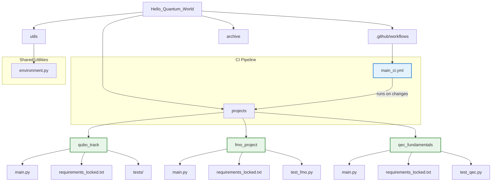

# Hello, Quantum World: A Production-Grade Research Repository

[](https://github.com/your-username/hello-quantum-world/actions/workflows/main_ci.yml)

This repository contains a collection of research projects in quantum computing, which have been systematically refactored into production-grade, scientifically reproducible applications.

## Architecture



## Overview

The repository is organized into three core research tracks, each exploring a different area of quantum computing. Each project is self-contained, with its own locked dependencies, test suite, and documentation.

## Core Projects

### 1. `projects/qubo_track`
- **Topic**: Classical optimization using D-Wave's QUBO solvers.
- **Goal**: Provides a rigorous comparison between different classical samplers, including statistical analysis and effect size measurement.

### 2. `projects/fmo_project`
- **Topic**: Simulating noise-assisted quantum transport in a Fenna-Matthews-Olson (FMO)-like complex.
- **Goal**: Demonstrates how dephasing noise can enhance transport efficiency, a key phenomenon in quantum biology.

### 3. `projects/qec_fundamentals`
- **Topic**: Exploring the fundamentals of Quantum Error Correction (QEC).
- **Goal**: Implements and compares the 3-qubit bit-flip code and the 5-qubit Shor code in a controlled, statistically-validated framework.

## Repository Structure

- `.github/workflows/`: Contains the main Continuous Integration (CI) pipeline that automatically tests all three core projects.
- `projects/`: Contains the three main, self-contained research projects.
- `archive/`: Contains historical scripts, notebooks, and results that are not part of the active projects but are preserved for context.
- `docs/`: Contains general documentation for the repository.
- `benchmarks/`: Contains scripts for running performance and hardware benchmarks.

## Continuous Integration

All projects in this repository are automatically tested via our [main CI workflow](./.github/workflows/main_ci.yml). This ensures that the codebase remains robust, reliable, and scientifically valid.

## Hardware Benchmarking

This repository includes a benchmark harness for running experiments on real quantum hardware via AWS Braket.

To run a benchmark, use the `benchmarks/run_hardware_benchmark.py` script. For example, to see how a 3-qubit QEC circuit is compiled for an IonQ Aria device without actually running it, you can perform a "dry run":

```bash
python benchmarks/run_hardware_benchmark.py --dry-run
```

To run the same experiment on the actual hardware (requires AWS credentials and may incur costs):
```bash
python benchmarks/run_hardware_benchmark.py --device arn:aws:braket:us-east-1::device/qpu/ionq/Aria-1
```
